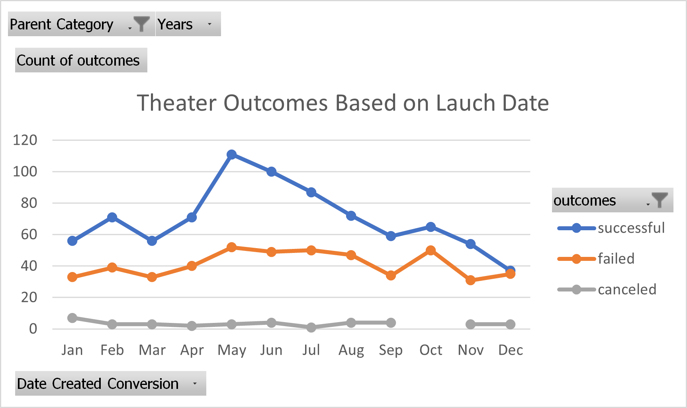
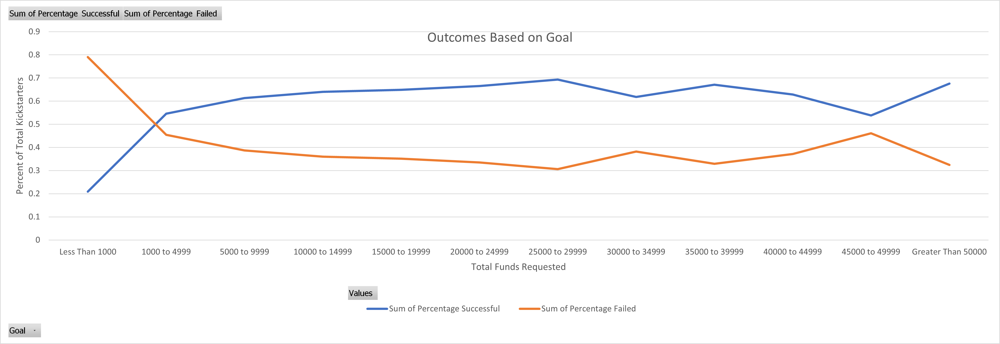
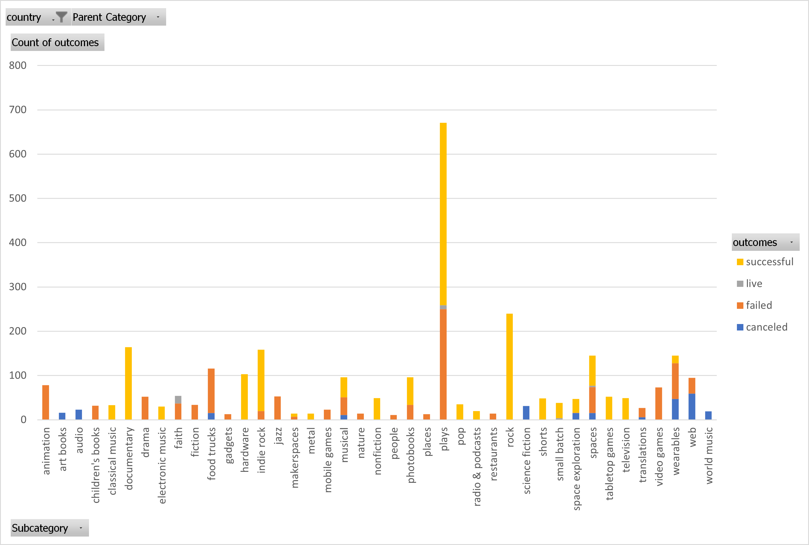

# Kickstarting with Excel

## **Overview of Project**
This is an analysis of Kickstarter data for customer Louise, handled with Excel.
### **Purpose**
This analysis aims to show the relationship between factors relating to the success of the Kickstarter data. Additionally it showcases various features in Excel to make analysis easier.
## **Analysis and Challenges**
The deliverable analysis focuses on showing the relationship between launch date of a Kickstarter and total requested funds, and their success rates. The goal was to create tables and charts to allow the customer to launch and fund their Kickstarter.
## Analysis of Outcomes Based on Launch Date

The chart `Theater_Outcomes_vs_Launch.png` shows a count of all campaigns in the data set grouped by success and month it was launched in. This data shows that in the provided data set, most of the successful campaigns each year were launched in May through September. 
### Opinion and Conclusion
The chart is only a count of total failed or successful campaigns in a given month. Both failed and successful data sets have a similar rise and fall aside from the immense increase during the summer months. It seems that by releasing early in the summer there is a higher likelihood of success.
## Analysis of Outcomes Based on Goals

The chart `Outcomes_vs_Goals.png` shows the percent of Kickstarters that failed or succeeded based on increments of their total requested funds. This data suggests that, aside from outliers, Kickstarters tend to succeed more often with requests of less than $30,000.
### Opinion and Conclusion
The data suggests that campaigns are most successful when asking for less than $30,000. There is a trend downward after that data point, but a peculiar hill within the decline could suggest individual backer habits. Perhaps the legitimacy of a campaign is viewed differently at those dollar points. This is my thought for the spike at the end, because this chart only shows the relationship between success or failure at a set dollar point. Perhaps backers who understand a product won't be daunted by the asking price. The inverse could be said for campaigns which asked for less than $1,000; perhaps backers question the legitimacy of something cheaper.
### Challenges and Difficulties Encountered
This project was a lot for me to grasp all at once but after going through the modules and classes I feel that the product was good.
I initially had some difficulty using the `COUNTIFS()` formula because I was canfused on the filtering syntax used in the module hint.
There the code was
```
=COUNTIFS(Kickstarter!$E:$E, "<1000",Kickstarter!$H:$H, "US",Kickstarter!$V:$V, "rock")
```
However I realized that I didn't need to include all of the filtration syntax because I had used the built in filters in Excel to narrow down the ranges I needed. So I simply had to mawe sure the correct filter was applied to the Kickstarter sheet before executing the much simpler
```
=COUNTIFS(Kickstarter!D:D, "<1000")
and
=COUNTIFS(Kickstarter!D:D, ">=1000", Kickstarter!D:D, "<=4999")
```
### Problems With the Data Set

This chart counts the total numer of campaigns by subcategory. Now, because of the nature of our customer's interests (i.e. plays) this set contains a lot mory data points from `play` categories than any other type of campaign. This would greatly influence the quality of the data because we are primarily grabbing from a very niche market. Kickstarter is host to many campaigns, and many more that are not plays. If we were to look at a set of all campaigns I imagine that, in relation to all other campaigns, plays may not fare as well when getting funding.
I also attempted to parse the data while filtering for the `Staff Pick` Boolean. Ultimately I observed that, while getting a coveted staff pics did boost the likelihood of success, it was not a significant enough variance to report on, and thus likely not worth pursuing actively for Louise.
